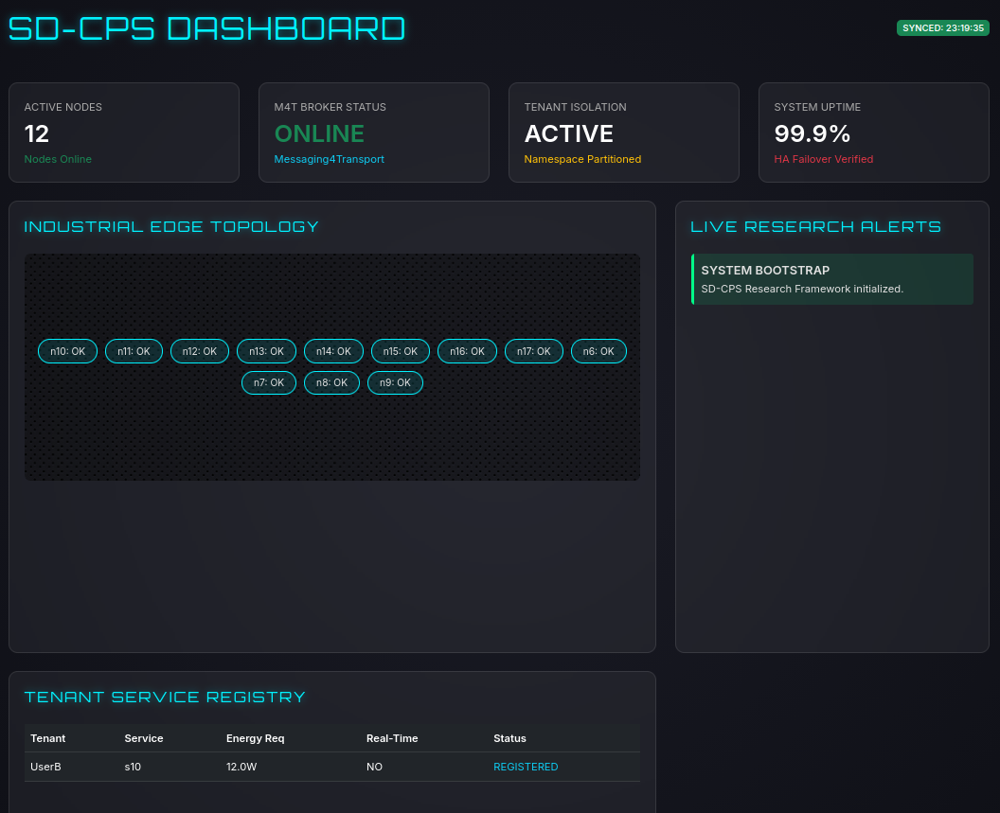

# SD-CPS User Guide

This guide provides detailed instructions on how to use the SD-CPS (Software-Defined Cyber-Physical Systems) Research Framework, including the Interactive Shell and the Live Research Dashboard.

## 1. Interactive Research Shell

The interactive shell allows you to manually trigger events and manage the Control Plane in real-time.

### Launching the Shell
```bash
./sdcps.sh interactive
```

### Available Commands

| Command | Description | Example |
|---------|-------------|---------|
| `nodes` | List all operational edge nodes and their current metrics (Energy, Latency). | `nodes` |
| `addnode` | Scale the topology by adding a new edge node with energy constraints. | `addnode n18 100.0 4.0 12.0` |
| `users` | List all registered tenants (users) and their assigned services. | `users` |
| `services` | Flattened list of all registered services and their CPS metadata. | `services` |
| `register` | Onboard a new user/tenant by registering a service for them. | `register UserA s5 10.0 true` |
| `crash` | Simulate a hardware failure on a specific edge node. | `crash n10` |
| `congestion` | Trigger network congestion on a node to test adaptation logic. | `congestion n12` |
| `jitter` | Inject network jitter (latency) between two nodes. | `jitter n10 n12 50` |
| `help` | Show the command help menu. | `help` |
| `quit` | Exit the interactive shell. | `quit` |

---

## 2. Topology Configuration (`topology.json`)

Inside the project root, you will find `topology.json`. This file allows you to define the base edge network without modifying the source code.

### Schema
Each node in the JSON array supports the following parameters:
- `id`: Unique identifier for the node (e.g., `n9`).
- `neighbors`: List of adjacent node IDs.
- `services`: Default services hosted by this node.
- `energy`: Thermal/Energy capacity in Watts.
- `latency`: Base network latency in ms.
- `cost`: Operational cost of the node.
- `resources`: CPU/Resource capacity.

Changes made to this file take effect upon the next framework launch.

---

## 3. Live Research Dashboard



The dashboard provides real-time observability into the simulation state. It automatically refreshes every 5 seconds to sync with the backend.

### Sections
1. **Key Metrics**:
    - **Active Nodes**: Total nodes currently operational in your topology. The framework supports dynamic scaling (the default is a 12-node topology. But more nodes can be added or removed from the topology using the `addnode` and `crash` commands in the interactive shell).
    - **Research Case Studies**: Progress of automated research trials.
    - **Tenant Isolation**: Status of the multi-tenant namespace partitioner.
    - **System Uptime**: Live HA status (dips during orchestrator crashes).

2. **Industrial Edge Topology**:
    - A dynamic map of all nodes.
    - **OK**: Node is healthy.
    - **(HOT)**: Node is experiencing heavy load/congestion.
    - **(CRASHED)**: Node has suffered a hardware failure.

3. **Tenant Service Registry**:
    - High-fidelity view of service placements.
    - **ORCHESTRATED**: Service successfully deployed.
    - **BLOCKED (THERMAL)**: Deployment failed due to energy constraints.
    - **UNAUTHORIZED**: Blocked security violation (Multi-tenancy breach).

4. **Live Research Alerts**:
    - A scrolling feed of internal system events, orchestration decisions, and research outcomes.

---

## 3. High Availability (HA) & Failover

The framework implements a Primary/Backup orchestrator model (SDS 2017).

- When the **Primary Orchestrator** is crashed (either via Case Study 5 or manual trigger), the **System Uptime** metric will drop.
- The **Backup Orchestrator** detects the heartbeat failure and initiates a failover.
- Once the backup is promoted to Primary, the dashboard reflects recovery and uptime returns to 99.9%.

---

## 4. Troubleshooting
- **Broker Errors?** If you see "AMQP Broker not detected," you can start the broker using `./sdcps.sh broker` (Docker required).
- **Stopping the Broker**: To free up resources, you can stop the messaging infrastructure using `./sdcps.sh broker-stop`.
- **Dashboard not updating?** Ensure you are running a simulation or the interactive shell. The data is exported to `dashboard_data.js` in the project root.
